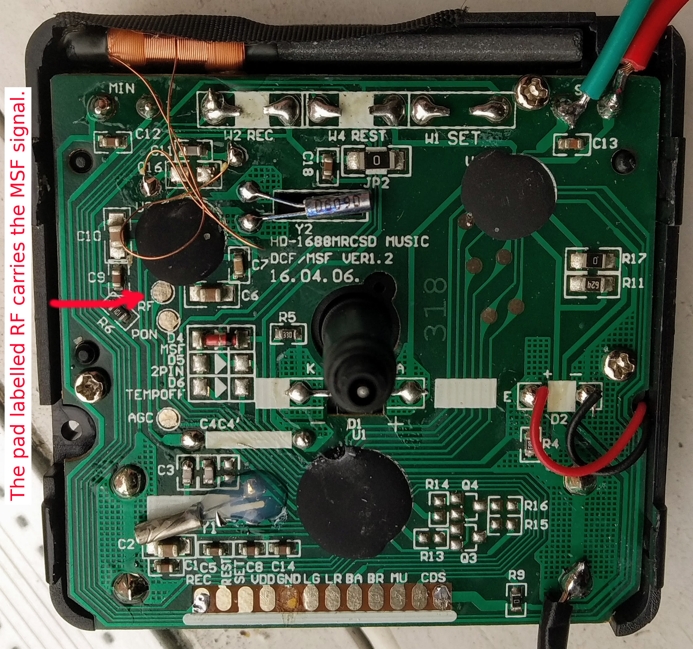

# msf-clock
In which I destroy a perfectly good radio-controlled clock in order to build a radio-controlled clock.

I bought a cheap radio-controlled clock mechanism, with hour, minute and second hands. I was intrigued to figure out how to decode [the MSF signal](https://www.npl.co.uk/products-services/time-frequency/msf-radio-time-signal/msf_time_date_code), broadcast on 60kHz from Anthorn, Cumbria. After poking around the innards a bit, I eventually found a solderable pad that tracked a digitised version of the signal, and then wrote Arduino code for an ATTINY1614 to decode it.

